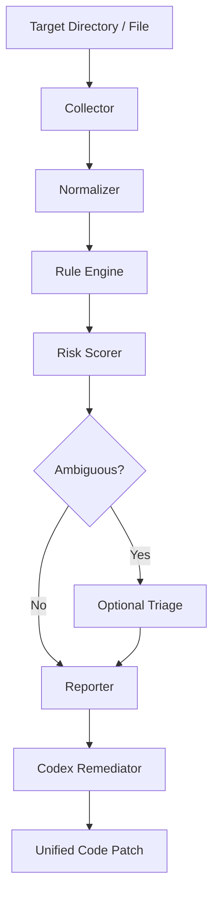

# Architecture: Module Layout, Pipeline, & Data Models

This document details the modular layout, system data models, and scan pipeline flow for **AgentPreflight**.

---

## 1. System Pipeline Flow

The scan operations follow a strict, linear pipeline:



1. **Collector**: Recursively lists target files, identifying MCP configs (`mcp.json`), skill markdown files (`SKILL.md`), and script files (Python, TypeScript).
2. **Normalizer**: Prepares text and files for inspection by stripping zero-width joiners, resolving homoglyphs into canonical Unicode form (NFKC), and redacting secrets.
3. **Rule Engine**: Evaluates a series of regex and AST patterns statically.
4. **Risk Scorer**: Computes the Trust Score (0-100) based on weighted violation rules.
5. **Reporter**: Generates text summaries, JSON outputs, or formal SARIF files.
6. **Codex Remediator**: Integrates with OpenAI Codex to construct safe, reviewable diff patches.

---

## 2. Directory & Module Layout

The codebase is organized modularly in Python:

```text
src/
├── collectors/                # Config and file crawlers
│   ├── mcp_collector.py       # Reads and parses mcp.json manifests
│   └── skill_collector.py     # Crawls skill markdown and Python/TS scripts
├── normalisers/               # Unicode, homoglyphs, and secret scrubbing
│   ├── unicode_normalizer.py  # Cleans zero-width obfuscation and homoglyphs
│   └── scrubber.py            # Redacts PII/Secrets before external API calls
├── engine/                    # Regex and AST rule execution
│   ├── rule_engine.py         # Drives execution of the rule list
│   └── ast_checker.py         # AST parser for Python subprocess execution
├── scorer/                    # Trust Score calculations
│   └── scoring_engine.py      # Weights findings to yield a 0-100 score
├── remediator/                # OpenAI Codex patch generator
│   └── codex_patcher.py       # Constructs prompt templates and generates diffs
├── cli/                       # Terminal entrypoint (argparser)
│   └── cli_handler.py         # Handles terminal inputs and stdout dashboards
└── api/                       # HTTP REST microservice
    └── main.py                # FastAPI endpoints and webhook handlers
```

---

## 3. Data Models (Pydantic Schema)

We define our key pipeline entities in Pydantic:

```python
# src/scorer/models.py
from pydantic import BaseModel, Field
from typing import List, Optional

class Finding(BaseModel):
    rule_id: str = Field(..., description="Unique rule code, e.g. AP-PI-001")
    severity: str = Field(..., description="Severity level: critical, high, medium, low")
    category: str = Field(..., description="Category, e.g. tool_poisoning")
    file_path: str = Field(..., description="Target file path relative to scan root")
    line_number: int = Field(..., description="1-indexed line number containing violation")
    evidence: str = Field(..., description="Clean snippet of the violation code")

class ScanResult(BaseModel):
    scan_id: str
    timestamp: str
    trust_score: int = Field(..., ge=0, le=100)
    verdict: str = Field(..., description="Verdict: pass or fail")
    findings: List[Finding]
    remediation_available: bool = False
```
