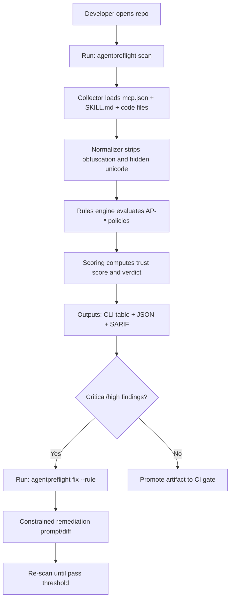
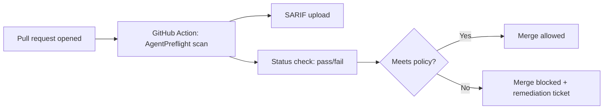

# AgentPreflight user flow diagram

## Primary CLI flow (MVP)

```mermaid
flowchart TD
    A[Developer opens repo] --> B[Run: agentpreflight scan <path>]
    B --> C[Collector loads mcp.json + SKILL.md + code files]
    C --> D[Normalizer strips obfuscation and hidden unicode]
    D --> E[Rules engine evaluates AP-* policies]
    E --> F[Scoring computes trust score and verdict]
    F --> G[Outputs: CLI table + JSON + SARIF]
    G --> H{Critical/high findings?}
    H -- Yes --> I[Run: agentpreflight fix --rule <id>]
    I --> J[Constrained remediation prompt/diff]
    J --> K[Re-scan until pass threshold]
    H -- No --> L[Promote artifact to CI gate]
```

## CI/GitHub flow

```mermaid
flowchart LR
    PR[Pull request opened] --> ACT[GitHub Action: AgentPreflight scan]
    ACT --> SARIF[SARIF upload]
    ACT --> CHECK[Status check: pass/fail]
    CHECK --> MERGE{Meets policy?}
    MERGE -- Yes --> DONE[Merge allowed]
    MERGE -- No --> BLOCK[Merge blocked + remediation ticket]
```
