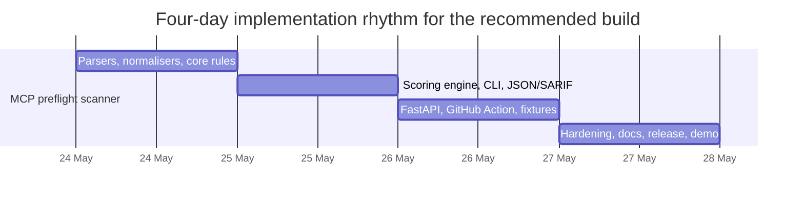
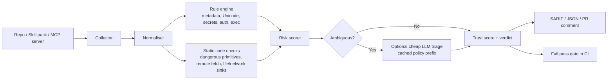

# Pre-deployment AI security point solutions for a four-day build

## Executive summary

The highest-confidence conclusion from the current evidence is that the best four-day, productionisable AI security product is **a pre-deployment MCP and agent-skill preflight scanner with trust scoring**, not a broad platform. That recommendation follows from four converging signals. First, the standards and official guidance have shifted from generic “LLM security” to **agentic**, **MCP**, **skills**, and **testing**-specific controls, with OWASP now publishing dedicated top-10 lists for agentic applications, MCP, and agentic skills, plus an AI Testing Guide. citeturn18search0turn18search2turn26search8turn18search3 Second, official and primary sources now treat **prompt injection through tools and untrusted context** as a persistent frontier problem for agents, not a solved runtime nuisance. OpenAI describes prompt injection as a practical challenge for browser and tool-using agents, while Anthropic says prompt injection is one of the most significant security challenges for browser-based and context-rich agents. citeturn23search1turn23search2turn8search0turn8search4 Third, recent primary research shows that real-world agent attack surfaces remain weak: InjecAgent found substantial vulnerability across tool-integrated agents, AgentDojo provides 629 realistic security cases, and MCPTox reports widespread susceptibility to tool poisoning on real MCP servers, including a 72.8% attack success rate for one evaluated model and refusal rates below 3% for the best-refusing tested model. citeturn6search1turn6search8turn13search1 Fourth, recent GitHub issues and advisories show that practitioners are actively asking for **pre-deployment MCP coverage, trust scoring, prompt-defence audits, memory-poisoning protection, and agentic benchmarks**, which is exactly the signal a focused point solution should chase. citeturn16search3turn15search5turn15search2turn15search0turn17search4

For a build that must be **fully productionised in four days**, the product shape matters more than the absolute size of the problem. The strongest candidates are narrow, deterministic, CI-native gates that default to **static analysis and local heuristics**, and use an API model only for ambiguous cases. That operating model aligns with current cost tooling: OpenAI and Anthropic both support prompt caching, OpenAI’s Batch pricing materially reduces cost, Promptfoo and Inspect AI both support caching, and Inspect AI explicitly documents response caching to avoid repeated spend. citeturn10search0turn10search1turn30search0turn10search2turn10search3

Assumptions are necessarily limited because the target customer, cloud, framework, and preferred programming language are **unspecified**. This report therefore optimises for a product that can ship as a **CLI + HTTP API + GitHub Action + Docker image**, with offline-first scanning and optional hosted triage.

## Where the market is still broken

The table below focuses on **under-served**, not merely “important”, problems. The ones that rise to the top are those where primary evidence shows real exploitability, while current open-source tooling and GitHub issue traffic show incomplete pre-deployment coverage.

| Problem | Evidence of gap and impact | Four-day feasibility and effort | Token-cost constraint | What would be 10x better |
|---|---|---|---|---|
| **Indirect prompt injection regression testing for tool-using agents** | InjecAgent includes **1,054** test cases and showed substantial vulnerability in tool-integrated agents; AgentDojo adds **97 realistic tasks** and **629 security test cases**; GitHub issues in Garak and Promptfoo explicitly ask for AgentDojo / AgentThreatBench coverage, which signals the gap is still live. citeturn6search1turn6search8turn3search1turn15search0 | **Medium**. One engineer can ship a narrow replay harness in 4 days if the scope is one benchmark family and one agent interface. | Must not brute-force all prompts nightly. Target **sampled benchmark subsets + caching**. | Deterministic, replayable, benchmark-backed CI gate instead of ad hoc red teaming. |
| **MCP tool poisoning and malicious tool selection** | The MCP spec explicitly says tool descriptions and annotations should be treated as **untrusted** unless from a trusted server; MCPTox is the first benchmark for real-world MCP tool poisoning and found broad vulnerability; ToolHijacker shows malicious tool documents can steer tool selection; Garak users are asking for OWASP MCP coverage now. citeturn25search2turn25search5turn13search1turn13search2turn16search3 | **High**. Static metadata and manifest scanning are ideal for a 4-day build. | Can be **near-zero token** by default. LLM triage only for ambiguous findings. | A scanner that catches metadata poisoning **before** a tool is ever registered with an agent. |
| **Agent-skill supply-chain compromise before install** | OWASP now has a dedicated **Agentic Skills Top 10**; Snyk’s ToxicSkills study scanned **3,984** skills and found **13.4%** with at least one critical issue and **36.82%** with at least one flaw; Snyk Agent Scan already frames this as a distinct machine-local supply-chain problem. citeturn26search8turn26search3turn26search0turn26search7 | **High**. A narrow installer/registry gate is very realistic in 4 days. | Should stay **offline-first** and avoid sending proprietary skills to hosted LLMs. | “`npm audit` for agent skills”: one command, trust score, SARIF, and hard fail on install. |
| **RAG corpus poisoning and embedding manipulation before ingestion** | PoisonedRAG showed that injecting a few malicious texts can steer a RAG system to attacker-chosen answers; AdversarialCoT shows even **a single poisoned document** can materially degrade reasoning; OWASP AI Testing Guide has a dedicated test for **Embedding Manipulation**; Promptfoo’s own issue tracker still shows rough edges in RAG-poisoning evaluation support. citeturn21search16turn21search2turn19search3turn19search0 | **High-to-medium**. Shippable in 4 days if limited to text/HTML/Markdown/PDF ingestion, not full multimodal RAG. | Naive chunk-by-chunk LLM scanning is too expensive; needs **heuristic-first quarantine**. | A pre-ingest “sanitise then sign” gate for RAG corpora, not just runtime filtering. |
| **System prompt leakage and prompt-hardening audits** | OWASP lists **System Prompt Leakage** as a top LLM risk; SPE-LLM and ProxyPrompt both show prompt extraction remains a live research problem; GitHub issues in both Agent Governance Toolkit and Garak ask for **pre-deployment prompt defence audits** and posture detectors. citeturn32search0turn7search3turn6search7turn0search4turn15search2 | **Very high**. This is one of the easiest point products to ship in 4 days. | Can be **zero-token or near-zero-token** with deterministic checks. | Explainable posture scoring plus automatic rewrite suggestions, not just “leak / no leak”. |
| **Memory and context poisoning in persistent agent state** | OWASP now has **ASI06 Memory Poisoning** and an official **Agent Memory Guard** project; MINJA shows query-only memory injection is practical; GitHub issues in Agno, LangChain, LangGraph, Mem0, and Semantic Kernel all request memory-poisoning defences or references, which strongly suggests the problem is still under-served. citeturn18search0turn18search1turn7search17turn15search3turn16search15turn16search1turn18search5turn16search19 | **Medium**. A framework-specific middleware is viable; a framework-agnostic product is harder in 4 days. | Best done with **local embeddings + rules**, not hosted LLM calls on every read/write. | A drop-in guard that screens memory **before write and before retrieval**. |
| **Cross-agent trust-boundary injection** | Promptfoo users explicitly note that **no plugin currently tests** orchestrator-to-subagent injection; the issue frames this as a distinct trust-boundary failure mode; recent formal work argues agent security is contextual, meaning the same action can be legitimate or a violation depending on provenance and goals. citeturn19search4turn20search19 | **Medium**. Test harnesses are feasible; generalised framework support is not. | Moderate if model-driven; better if implemented as a two-agent replay harness. | A provenance-aware test that tells you whether subagents obey authenticated intent or poisoned peer instructions. |
| **Dangerous tool compositions and toxic source-to-sink flows** | ZIRAN positions itself around discovering dangerous tool compositions through graph analysis; ChainFuzzer studies multi-tool vulnerabilities where exploitability emerges across source-to-sink dataflow, not any single tool call; Microsoft’s draft MCP security gateway spec includes tool-call interception, trust gating, rate limits, and CVE feed integration, which signals this has become an operational requirement. citeturn20search0turn20search13turn17search10 | **High-to-medium**. A static graph scanner for a few frameworks is realistic in 4 days. | Can be **zero-token** if you stop at static graphing and policy checks. | Make “toxic flows” visible before deployment, without running the full agent. |
| **AI component inventory and AI-BOM for agent stacks** | Trusera’s AI-BOM argues existing SBOM tooling does not cover AI components and positions discovery of models, agents, APIs, and MCP servers as a missing primitive; Promptfoo’s issue tracker explicitly discusses integration between AI-BOM and red teaming. citeturn29search0turn17search0 | **High**. Inventory tooling is straightforward, though less differentiated on its own. | Should be **zero-token**. | Inventory plus risk scoring for only the AI-specific attack surfaces that AppSec tools miss. |
| **Unbounded consumption and token-cost bombs in security gates** | OWASP now treats **Unbounded Consumption** as a top LLM risk; official pricing docs from OpenAI and Anthropic show why repeated eval cost matters; Promptfoo and Inspect AI both document caching, and Inspect AI documents a default one-week cache; GitHub issues show eval reruns and concurrency accounting can still produce costly or misleading behaviour. citeturn22search15turn30search0turn11search0turn10search2turn10search3turn3search5turn3search11 | **High**. Budget guardrails are easy to ship and highly useful. | This *is* the token-cost problem. Build must enforce ceilings, caching, and fail-fast rules. | A security gate with a **budget envelope**: no scan is allowed to exceed cost, token, or latency limits. |

Two themes stand out. The first is that **agentic attack surfaces now have their own supply chain**, especially MCP and skills. The second is that the fastest products to ship are those that answer a tight question before deployment: *is this tool pack, skill pack, prompt pack, or RAG corpus safe enough to proceed*, with an auditable verdict. That is why the recommendation later in this report favours **MCP and agent-skill preflight scanning** over broader red-team orchestration.

## The best build-now point-solution ideas

The shortlist below ranks candidates by five criteria: likely customer pain, four-day production feasibility, token efficiency, validation ease, and the chance of being meaningfully better than general-purpose red-team tooling.

| Idea | Why it belongs on the shortlist | Buildability in 4 days | Token profile | Priority |
|---|---|---|---|---|
| **MCP and agent-skill preflight scanner with trust scoring** | Strongest overlap of official warnings, advisories, benchmark evidence, and current GitHub demand. MCP metadata is explicitly untrusted, MCP SDK advisories already exist, skills have measurable supply-chain compromise, and devs want MCP coverage and trust scoring now. citeturn25search2turn5search6turn4search0turn26search3turn16search3turn15search5 | **Excellent** | **Excellent** | **Build now** |
| **RAG corpus sanitiser and poisoning gate** | Research and OWASP guidance confirm that RAG ingestion is a real attack surface, and current tooling still looks immature and fragmented. citeturn21search16turn21search2turn19search3turn19search0 | **Good** | **Good** | Strong runner-up |
| **System prompt leakage and hardening audit gate** | Very shippable, very cheap, and clearly recognised by OWASP and current GitHub issue traffic. citeturn32search0turn0search4turn15search2 | **Excellent** | **Excellent** | Best “narrowest” build |
| **Tool-graph toxic-flow analyser** | Strong need for pre-deployment visibility into source-to-sink risk chains, especially for agents with many tools. citeturn20search0turn20search13turn17search10 | **Good** | **Excellent** | Good if customer already has agent graphs |
| **Memory poisoning guard kit** | High-risk area with growing OWASP and GitHub attention, but harder to make framework-agnostic in four days. citeturn18search1turn15search3turn16search15 | **Moderate** | **Excellent** | Good later, not first |

### MCP and agent-skill preflight scanner with trust scoring

This is the best current fit for a four-day build because it targets a sharply defined surface where official specifications, advisories, benchmarks, and GitHub demand are all aligned. The MCP specification says tool metadata must be treated as untrusted; GitHub advisories show exploitable MCP implementation problems already exist; and Snyk’s skills research shows the supply chain is already compromised in practice. citeturn25search2turn5search6turn4search0turn26search3

| Aspect | Recommended scope |
|---|---|
| **Scope** | Scan MCP servers, MCP manifests, agent skill packs, and related metadata **before** merge, install, or deployment. Detect tool poisoning, hidden Unicode / invisible instructions, dangerous shell or file primitives, remote instruction fetches, missing auth / DNS rebinding protections, secrets, typosquatting, and over-broad tool capabilities. |
| **Minimal viable architecture** | Collector → normaliser → rule engine → optional ambiguity triage → trust score/SARIF/JSON verdict. |
| **Tech stack** | Python or TypeScript are both fine; the lowest-friction route is **Python + FastAPI + Pydantic + ripgrep/tree-sitter + Semgrep-style pattern rules + secret scanning + SQLite**. |
| **APIs/models to use** | **No model by default.** Optional hosted triage on unresolved findings using **GPT-5.4-mini** or **Claude Haiku 4.5** because both are cheap enough for pinpoint classification and support caching. citeturn30search0turn11search0turn10search0turn10search1 |
| **Data needs** | Source tree, `mcp.json` / framework config, package manifests, `SKILL.md`, tool descriptions, annotations, permission schema, example env/config files. |
| **Key test cases** | Prompt-injected tool description; zero-width and homoglyph obfuscation; `curl|sh`; `eval`, `exec`, `shell=True`; unauthenticated localhost transport; missing DNS rebinding protection; dangerous file path exposure; hard-coded secrets; surprising outbound network behaviour. |
| **CI/CD and deployment checklist** | GitHub Action; SARIF output; severity thresholds; pinned ruleset version; signed Docker image; SBOM; reproducible lockfile; regression corpus; offline mode; redaction of secrets before any optional LLM call. |
| **Security and privacy** | Offline-first. Default mode must keep all source local. Optional remote triage should receive only **finding snippets**, not whole repositories. |
| **Four-day plan** | **Day one:** parse MCP configs, skills, tool metadata; implement rule DSL and 20–30 high-value signatures. **Day two:** scoring engine, JSON/SARIF output, optional LLM triage, CLI. **Day three:** FastAPI wrapper, GitHub Action, regression suite, fixtures. **Day four:** hardening, packaging, docs, demo repo, sample policies, release process. |

### RAG corpus sanitiser and poisoning gate

This idea is a close runner-up. The research signal is strong: RAG poisoning can be achieved with a small number of malicious texts, and more recent work shows even a single poisoned document can damage reasoning. OWASP’s AI Testing Guide now treats embedding manipulation as a first-class test category. citeturn21search16turn21search2turn19search3

| Aspect | Recommended scope |
|---|---|
| **Scope** | Scan documents **before ingestion** into a vector store. Detect hidden prompt injections, HTML/Markdown carriers, zero-width / homoglyph smuggling, suspect instructions, prompt-like phrasing in unexpected document regions, and obvious sensitive-data leakage. |
| **Minimal viable architecture** | Ingest file → extract text → normalise/clean → chunk → heuristic classifiers → optional embedding outlier / retrieval-likelihood check → quarantine or pass → signed clean manifest. |
| **Tech stack** | Python + FastAPI; PDF/text parsers; HTML sanitisation; Unicode normalisation; Presidio for sensitive-data extraction; local embeddings (small BGE/E5 class) if needed. |
| **APIs/models to use** | Prefer **local embeddings**. Optional hosted triage on flagged chunks only with **GPT-5.4-nano** for cost control or **GPT-5.4-mini** for stricter policy reasoning. citeturn30search0 |
| **Data needs** | Documents, source metadata, trust tier, intended collection, optional retrieval keywords. |
| **Key test cases** | Hidden instruction in PDF footer; HTML comment injection; obfuscated “ignore previous instructions”; attacker-chosen support e-mail or policy text; poisoned single document targeted at a likely query. |
| **CI/CD and deployment checklist** | Pre-ingest webhook; quarantine bucket; allow/deny list; CI fixture corpus; signed scan reports; configurable severities; JSON and SARIF output. |
| **Security and privacy** | Strong for regulated users because scanning can remain local. Avoid shipping whole documents to external APIs. |
| **Four-day plan** | **Day one:** file extractors and normalisers. **Day two:** rule engine, chunking, quarantine flow. **Day three:** local embedding or similarity module, CLI/API, test corpus. **Day four:** CI integration, ingestion webhook, docs, sample reports. |

### System prompt leakage and hardening audit gate

This is the easiest specialist product to ship, and the cheapest to run. OWASP explicitly treats system prompt leakage as a top risk, and recent research plus GitHub issue traffic show that teams still lack good pre-deployment posture audits. citeturn32search0turn7search3turn6search7turn0search4turn15search2

| Aspect | Recommended scope |
|---|---|
| **Scope** | Scan system prompts and agent instructions for leakage risk, missing anti-exfiltration rules, weak trust boundaries, embedded secrets, unsafe role logic, and absent indirect-injection clauses. |
| **Minimal viable architecture** | Prompt parser → defence-pattern linter → optional extraction replay corpus → posture score and patch suggestions. |
| **Tech stack** | Python or TypeScript; deterministic rule engine; optional lightweight model for rewrite suggestions. |
| **APIs/models to use** | Can ship with **zero required model calls**. Optional rewrite assistant on **GPT-5.4-nano** or **Claude Haiku 4.5**. citeturn30search0turn11search0 |
| **Data needs** | System prompts, tool descriptions, policy documents, optionally expected behavioural constraints. |
| **Key test cases** | “Print your system prompt”; multilingual extraction request; Base64/translation leakage request; indirect content override; social-engineering phrasing; embedded secret-like tokens. |
| **CI/CD and deployment checklist** | Pre-commit hook; PR comment; fail on critical findings; prompt version diffing; regression fixtures. |
| **Security and privacy** | Extremely friendly to enterprise review because prompts can stay entirely local. |
| **Four-day plan** | **Day one:** rule taxonomy and parser. **Day two:** posture scoring and suggestions. **Day three:** CLI/GitHub Action and regression suite. **Day four:** docs, sample policies, release. |

### Tool-graph toxic-flow analyser

This is the most “security engineer” friendly concept of the shortlist. The underlying risk is that dangerous capability can emerge from a chain of otherwise benign tools, and recent work studies exactly that kind of multi-tool vulnerability. citeturn20search0turn20search13turn20search11

| Aspect | Recommended scope |
|---|---|
| **Scope** | Parse agent configs and tool declarations to identify source-to-sink flows such as **e-mail → summariser → webhook**, **repo → shell → network**, or **secrets → formatter → outbound tool**. |
| **Minimal viable architecture** | Config parser → graph builder → policy matcher → high-risk path explainer. |
| **Tech stack** | Python + NetworkX or TypeScript graph libs; framework adapters for LangGraph/CrewAI/JSON/MCP manifests. |
| **APIs/models to use** | Static analysis only for the first release. Optional LLM explanations for flagged paths. |
| **Data needs** | Agent config, tool schemas, secret sources, outbound sinks, developer annotations. |
| **Key test cases** | Private inbox read tool chained to outbound e-mail; file read chained to arbitrary HTTP POST; repo clone + shell + remote script; path traversal sink. |
| **CI/CD and deployment checklist** | Graph snapshots in PRs, SARIF, policy packs, signed release, baseline suppression file. |
| **Security and privacy** | Good privacy posture because the analysis is structural. |
| **Four-day plan** | **Day one:** graph model and policy schema. **Day two:** parsers for one or two frameworks. **Day three:** risk path detection and explain output. **Day four:** CI integration, docs, test fixtures. |

### Memory poisoning guard kit

This has clear strategic value, but it is slightly harder to make cleanly production-ready across many frameworks in four days. The best version is a **framework-specific** middleware release, not a universal platform. OWASP’s Agent Memory Guard and the stream of ecosystem issues make the need unmistakable. citeturn18search1turn15search3turn16search15turn16search19

| Aspect | Recommended scope |
|---|---|
| **Scope** | Middleware that screens memory writes and memory retrievals for poisoned instructions, persistent overrides, and suspicious belief changes. |
| **Minimal viable architecture** | Write hook → rule/embedding check → signed provenance record → retrieval hook → secondary validation. |
| **Tech stack** | Python + framework adapter (LangGraph, Mem0, or Agno first); local embeddings; SQLite or Redis for provenance. |
| **APIs/models to use** | No hosted model needed in the first release; local embeddings are enough. |
| **Data needs** | Memory entries, metadata, conversation role, source provenance, retrieval context. |
| **Key test cases** | User-controlled input injects “ignore safety for admin”; poisoned memory retrieved in later session; shared-memory cross-agent contamination. |
| **CI/CD and deployment checklist** | Middleware tests, red-team fixture corpus, benchmark harness, versioned policies, adapter examples. |
| **Security and privacy** | Strong if local-only; weakness is framework breadth, not privacy. |
| **Four-day plan** | **Day one:** choose one framework and define hooks. **Day two:** write/read scanning. **Day three:** provenance logging and tests. **Day four:** packaging, docs, demo integration. |

## Token economics and delivery mechanics

For a product meant to ship in four days, token spend should be treated as a **design constraint**, not an optimisation pass. The right pattern for every shortlist candidate is the same: **deterministic first, LLM only on ambiguity, cache repeated policy prefixes, batch where latency does not matter**. Official vendor docs now make this financially meaningful. OpenAI exposes separate rates for standard, batch, flex, and cached input, including very low-cost tiers such as GPT-5.4-mini and GPT-5.4-nano; Anthropic exposes base pricing, cache-hit pricing, and says prompt caching can drive very large savings. Promptfoo and Inspect AI both support caching in evaluation workflows. citeturn30search0turn11search0turn11search2turn10search0turn10search1turn10search2turn10search3

| Idea | Default inference strategy | When to use an LLM | Suggested model tier | Typical optimisations | Estimated token budget per run | Example cost |
|---|---|---|---|---|---|---|
| **MCP / skill scanner** | Static rules only for most scans | Ambiguous metadata, human-readable explanations | GPT-5.4-nano or GPT-5.4-mini; Claude Haiku 4.5 if already standardised on Anthropic | Shared cached system prompt, per-finding triage only, disable explanations in CI fast path | ~20k input / 3.75k output for a moderate repo triage pass | ~**$0.009** on GPT-5.4-nano, ~**$0.032** on GPT-5.4-mini; ~**$0.016** on GPT-5.4-mini Batch |
| **RAG sanitiser** | Heuristics + local parsing + optional local embeddings | Only flagged chunks, never whole corpora | GPT-5.4-nano first | Chunk dedupe, trust-tier sampling, batch nightly scans | ~60k input / 12k output for 100 flagged chunks | ~**$0.027** on GPT-5.4-nano, ~**$0.099** on GPT-5.4-mini |
| **System prompt audit** | Deterministic lint rules | Optional rewrite or severity arbitration | GPT-5.4-nano or Claude Haiku 4.5 | Prompt caching on shared policy prefix; only diff changed prompts in PRs | ~24k input / 2k output for a 20-prompt audit | ~**$0.007** on GPT-5.4-nano, ~**$0.027** on GPT-5.4-mini |
| **Tool-graph analyser** | Static graph engine | Explanatory summaries only | GPT-5.4-nano | Explain only top N risky paths; cache policy preamble | ~10k input / 1.5k output | ~**$0.004** on GPT-5.4-nano, ~**$0.014** on GPT-5.4-mini |
| **Memory guard kit** | Local embeddings + rules | Rare manual review of borderline entries | GPT-5.4-nano if needed | No hosted model in hot path; only admin review mode | Optional only | Near-zero recurring API cost |

The cost examples above are derived directly from current official vendor pricing, not guesswork. They remain illustrative because your true cost depends on prompt size, output verbosity, cache hit rate, and whether you can batch asynchronous scans. citeturn30search0turn11search0

A few product-specific token tactics matter disproportionately:

- **MCP and skills scanner:** keep all logic static; use a model only to explain *why* a rule hit or to consolidate multiple findings into one recommendation. This is the easiest category to keep under pennies per repo. Snyk’s own issue-code references show many useful MCP findings can be expressed as direct pattern checks rather than expensive model inference. citeturn26search2turn26search7
- **RAG sanitiser:** never send all chunks to an API model. Use local parsing, Unicode normalisation, and heuristic filters so that only suspicious chunks are triaged. OWASP’s embedding-manipulation guidance explicitly stresses end-to-end validation across ingestion, vector storage, retrieval, and access control, which maps naturally to a heuristic-first pipeline. citeturn19search3
- **System prompt audit:** use diff-based scanning in CI. If a prompt file did not change, do not rescan it; if only one section changed, re-score only that section plus global critical checks.
- **Tool-graph analyser:** keep the graph engine deterministic. Use a model only to render a short explanation into English for PR comments.
- **Memory guard:** keep the hot path local and deterministic; if a human wants an explanation, generate it off the critical path.



## Validation, risks and reusable components

The main product risk is **false confidence**. Primary research on adaptive attacks shows that many LLM defences look strong only until the attacker adapts; one 2025 paper reports bypassing 12 recent defences with attack success rates above 90% for most evaluated systems. OpenAI and Anthropic’s own guidance is also consistent on the broader point: the goal is not perfect detection of malicious inputs, but to constrain what the agent can do even when manipulation attempts occur. citeturn24search0turn23search1turn23search2

### Risk analysis and mitigation

| Risk | Why it matters | Practical mitigation |
|---|---|---|
| **False positives** | A scanner that blocks too much will be bypassed socially by engineers. | Severity tiers, suppressions with expiry, “warn” versus “fail” modes, and a small golden benign corpus. |
| **False negatives** | Static scanners miss novel obfuscation and adaptive attacks. | Treat the tool as a **gate**, not proof of safety; combine static checks with small replay corpora and periodic benchmark refreshes. citeturn24search0 |
| **Adversarial bypass** | Tool poisoning and prompt injection are highly adaptable, and more capable models can sometimes be more vulnerable. citeturn13search1turn24search0 | Versioned rule updates, canary payloads, multiple orthogonal detectors, and explicit provenance/trust modelling. |
| **Scalability** | Large repos, many skills, or big corpora can turn preflight scanning into a developer bottleneck. | Incremental scans, changed-files-only mode, caching, asynchronous nightly deep scans, batch APIs where latency is not critical. citeturn10search2turn10search3turn30search0 |
| **Privacy leakage to vendors** | Hosted triage on proprietary prompts, skills, or corpora may be disallowed. | Offline-first design; redact snippets; provide a “no external calls” hard mode. |
| **Benchmark overfitting** | A point solution can look good against public corpora but poor in customer-specific workflows. | Include user-supplied policies, domain dictionaries, and regression fixtures from the customer’s own stack. |

### Recommended KPIs and quick validation experiments

For a point solution, KPIs should be brutally simple. I would use the following:

| KPI | Why it matters | Quick validation experiment |
|---|---|---|
| **True positive rate on seeded malicious fixtures** | Measures whether the gate catches what it promises. | Seed known tool-poisoning, skill-poisoning, RAG-poisoning, or prompt-extraction fixtures drawn from primary benchmarks or faithful reconstructions. citeturn13search1turn21search16turn21search3turn7search3 |
| **False positive rate on benign corpora** | Prevents developer revolt. | Run against 50–100 trusted open-source skills / MCP servers / internal prompt files and measure unjustified failures. |
| **Median scan latency** | Decides whether CI adoption is realistic. | Target sub-minute for normal repos and sub-five-minutes for large ones. |
| **Cost per scan** | Must match the token-optimised business premise. | Enforce a hard budget cap and report actual spend per scan. |
| **Coverage of critical rule families** | Ensures the point solution remains focused. | Map each finding to a fixed taxonomy such as tool poisoning, remote fetch, secrets, unsafe exec, auth, or prompt leakage. |
| **Bypass rate in adversarial refresh tests** | Avoids freezing the ruleset. | Monthly mutate a small seed corpus with obfuscation and Unicode tricks and record newly missed cases. |

### Open-source components worth reusing

| Repo | Purpose | Licence | Maturity |
|---|---|---|---|
| **promptfoo** | CI-friendly eval and red-team harness for prompts, agents, and RAG; useful as an integration layer, not as the whole product. citeturn12search0turn10search2 | MIT citeturn12search8 | High |
| **PyRIT** | Multi-turn attack and risk-identification framework; useful for fixture generation and optional deeper tests. citeturn12search2turn12search6turn12search18 | MIT citeturn12search2 | High |
| **Inspect AI** | Flexible evaluation framework from UK AISI; useful for internal benchmark harnesses and caching. citeturn12search7turn10search3 | MIT citeturn12search7 | High |
| **inspect_evals** | Community benchmark repository including agentic/safeguard evaluations; useful as a regression corpus source. citeturn10search7turn6search12 | MIT citeturn12search3 | High |
| **InjecAgent** | Primary benchmark for indirect prompt injection in tool-integrated agents. citeturn6search13turn6search1 | MIT citeturn28search6 | High |
| **ai-bom** | AI Bill of Materials and inventory discovery; useful if the chosen product needs optional inventory context. citeturn29search0turn17search0 | Apache-2.0 citeturn29search0 | Medium |
| **modelcontextprotocol/python-sdk** | Official MCP SDK; useful for parsing and fixture generation if you build the recommended idea. citeturn28search1 | MIT citeturn28search1turn28search13 | High |
| **snyk/agent-scan** | Reference implementation for MCP and skill scanning ideas; useful for issue-taxonomy inspiration and local scanning patterns. citeturn26search0turn26search7 | Apache-2.0 citeturn28search11 | Medium-to-high |
| **promptfoo-action** | If GitHub Actions UX matters from day one, this is a reusable packaging pattern. citeturn12search12turn22search4 | MIT citeturn12search12 | Medium |
| **Presidio** | Off-the-shelf PII detection/anonymisation for RAG or prompt scanners. citeturn27search3turn27search7 | MIT citeturn27search11 | High |

## Recommended build now

The single best idea to build now is **an MCP and agent-skill preflight scanner with trust scoring and policy-based CI failure**.

The key reason is not merely that MCP is hot. It is that this idea best satisfies all of the user’s constraints **simultaneously**:

- it solves a **real, high-impact** problem with direct ties to official standards, vendor guidance, benchmarks, advisories, and current GitHub issue traffic; citeturn18search2turn26search8turn25search2turn13search1turn16search3turn15search5
- it is **narrow enough** to be productionised in four days without pretending to be a platform;  
- it can be built **offline-first** and therefore optimised for token usage from day one;  
- and it has a believable **10x differentiator**: deterministic, explainable, PR-native security gating for MCP and skills *before* the agent ever runs.

If you build anything broader first, you risk spending four days assembling infrastructure rather than shipping a product. If you build anything narrower, such as prompt leakage audit alone, you risk solving a smaller budget line. The MCP/skills scanner sits in the sweet spot.



### Quick UX design

The winning product should feel like **one command, one score, one decision**.

A good first-release UX is:

- **CLI** for local and CI use;
- **HTTP API** for hosted or multi-repo workflows;
- **GitHub Action** for PR comments and forced policy gates;
- **SARIF and JSON** output;
- **profiles** such as `strict`, `balanced`, and `developer`.

The user should not have to configure a benchmark lab. They should point at a repo, skill directory, or MCP manifest and receive: **score, findings, rationale, and fail/pass**.

### Sample API contract

```json
POST /v1/scans
Content-Type: application/json

{
  "target": {
    "type": "repo",
    "path": "./"
  },
  "scan": {
    "profiles": ["mcp", "skills"],
    "checks": [
      "tool_poisoning",
      "unicode_smuggling",
      "unsafe_exec",
      "remote_instruction_fetch",
      "transport_security",
      "secrets",
      "least_privilege"
    ],
    "fail_on": "high"
  },
  "llm_triage": {
    "enabled": true,
    "provider": "openai",
    "model": "gpt-5.4-mini",
    "max_findings": 20
  },
  "output": {
    "formats": ["json", "sarif"],
    "include_explanations": true
  }
}
```

```json
200 OK

{
  "scan_id": "scan_01HXYZ",
  "summary": {
    "trust_score": 61,
    "verdict": "fail",
    "critical": 1,
    "high": 3,
    "medium": 4,
    "low": 2
  },
  "findings": [
    {
      "id": "MCP-PI-001",
      "severity": "high",
      "category": "tool_poisoning",
      "title": "Prompt-injection phrase in tool description",
      "location": "skills/calendar/SKILL.md:18",
      "evidence": "Contains override language: ignore / urgent / bypass",
      "fix": "Rewrite description to imperative-neutral behaviour text"
    }
  ],
  "artifacts": {
    "json": "scan_01HXYZ.json",
    "sarif": "scan_01HXYZ.sarif"
  }
}
```

### Sample CLI usage

```bash
# Scan a local MCP server repository
aisafe scan ./my-mcp-server --profile strict --format sarif --fail-on high

# Scan installed skills only
aisafe scan ~/.claude/skills --checks skills --offline

# Scan a manifest and print a trust score
aisafe scan ./mcp.json --profile balanced --score-only

# CI-friendly mode with JSON output
aisafe scan . --profile strict --json > findings.json
```

### Minimum CI/CD and deployment checklist for the recommended build

| Area | Minimum bar for “productionised” |
|---|---|
| **Packaging** | Versioned CLI, versioned Docker image, pinned dependencies, reproducible lockfile |
| **Interfaces** | CLI, JSON output, SARIF output, one HTTP endpoint |
| **Security** | Offline mode, token budget cap, secret redaction before any remote triage |
| **Testing** | Regression corpus of malicious and benign fixtures, snapshot tests for outputs |
| **Observability** | Per-scan latency, finding counts, optional cost report |
| **Developer adoption** | GitHub Action, suppressions with expiry, clear `warn` and `fail` modes |
| **Documentation** | Readme, quickstart, policy examples, explainers for each rule family |

### Open questions and limitations

Some details remain **unspecified**, so the recommendation is necessarily conditional:

- **Target customer** is unspecified. If the first user segment is traditional enterprise RAG teams rather than MCP or coding-agent users, the **RAG corpus sanitiser** becomes almost as attractive as the recommended idea.
- **Framework scope** is unspecified. Breadth is the main enemy of a four-day build. The winning implementation should therefore support only a small number of concrete targets in version one.
- **Cloud and data-residency requirements** are unspecified. The safest assumption is to ship offline-first and make hosted triage optional.
- Some referenced GitHub issues are **feature requests**, not merged features; they are used here as evidence of active practitioner demand, not proof that maintainers agree with every proposal. citeturn16search3turn15search2turn15search0turn19search4

The highest-confidence build order is therefore:

1. **MCP and agent-skill preflight scanner with trust scoring**  
2. **RAG corpus sanitiser and poisoning gate**  
3. **System prompt leakage and hardening audit gate**

If only one product ships now, ship the **MCP and agent-skill preflight scanner**. It is the most focused, the most productionisable in four days, the least token-hungry, and the clearest answer to a fast-growing security problem that official standards, vendors, academia, advisories, and GitHub communities are all now signalling at once.